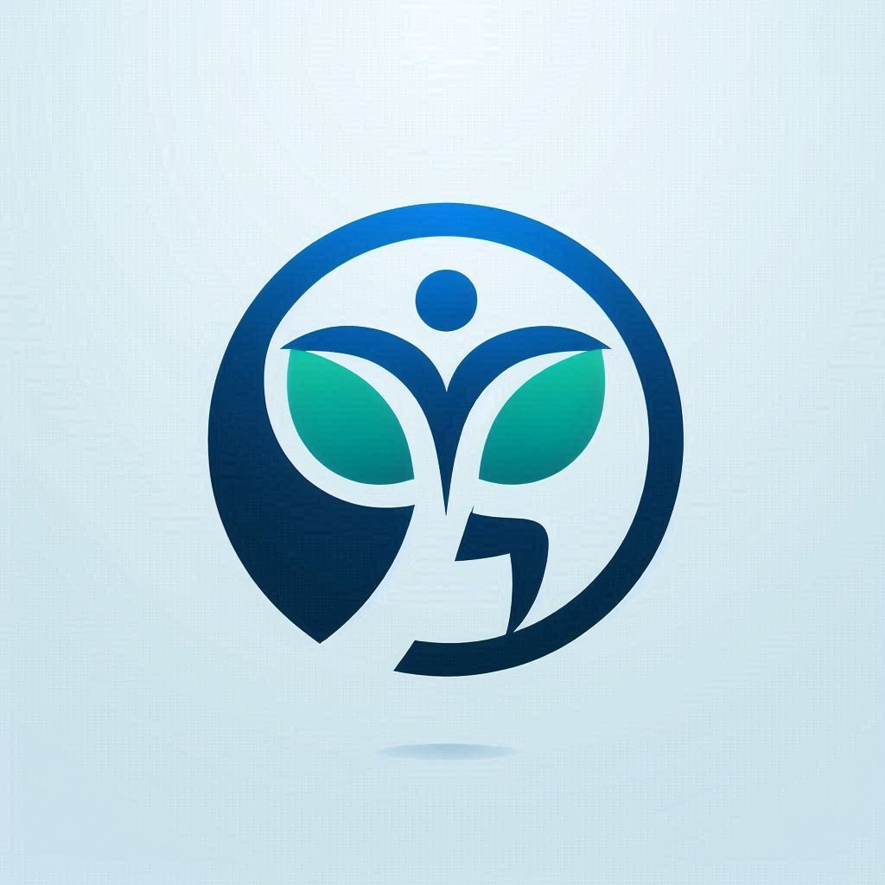

# ActiveLife 🍏🚴

## Proyecto para desarrollo de aplicaciones web

### Problematica
En el mundo actual, garantizar una vida sana y promover el bienestar para todas las personas de todas las edades sigue siendo un desafío significativo. A pesar de los avances en la medicina y la tecnología, muchos individuos aún enfrentan barreras para acceder a servicios de salud adecuados. Estas barreras incluyen la falta de información accesible sobre salud y bienestar, la insuficiencia de recursos para el seguimiento de hábitos saludables y la carencia de herramientas que faciliten la promoción de estilos de vida saludables.

### Descripción 
Este proyecto tiene como objetivo desarrollar una aplicación web utilizando Angular y .NET para abordar estos desafíos. La aplicación proporcionará una plataforma accesible y fácil de usar que permita a los usuarios obtener información confiable sobre salud y bienestar, realizar un seguimiento de sus hábitos de salud y recibir recomendaciones personalizadas. La plataforma incluirá secciones sobre nutrición, ejercicio, salud mental y prevención de enfermedades, así como herramientas interactivas para el monitoreo de la salud y el bienestar.

### Objetivos
✔ Proveer Información Accesible: Ofrecer información precisa y actualizada sobre diversos temas de salud y bienestar que sea accesible para personas de todas las edades.

✔ Monitoreo de Hábitos Saludables: Facilitar herramientas que permitan a los usuarios registrar y monitorear sus hábitos de salud, como la dieta, el ejercicio y el sueño.

✔ Recomendaciones Personalizadas: Desarrollar un sistema que ofrezca recomendaciones personalizadas basadas en los datos y hábitos de salud de los usuarios.

✔ Promoción del Bienestar Integral: Fomentar el bienestar integral mediante la inclusión de recursos y actividades que aborden la salud física, mental y emocional.

✔ Acceso Inclusivo: Garantizar que la aplicación sea accesible y fácil de usar para personas de todas las edades y capacidades.

### Aplicación

✔ Panel de Información: Una sección donde los usuarios pueden acceder a artículos, videos y recursos sobre salud y bienestar.

✔ Registro de Actividades: Herramientas para que los usuarios registren sus actividades diarias relacionadas con la salud, como la alimentación, el ejercicio y el sueño.

✔ Seguimiento de Progreso: Gráficos y estadísticas que muestren el progreso del usuario en sus objetivos de salud.

✔ Recomendaciones: Un motor de recomendaciones que sugiera actividades, dietas y ejercicios personalizados basados en los datos del usuario.

✔ Comunidad y Apoyo: Foros y grupos de apoyo donde los usuarios pueden interactuar, compartir experiencias y recibir apoyo de la comunidad.

### Collaborators
* Piña Del Valle José
* Arias Morales Yahir
* Ayala García Oscar Galo
* Rivera García Axel Maximiliano
